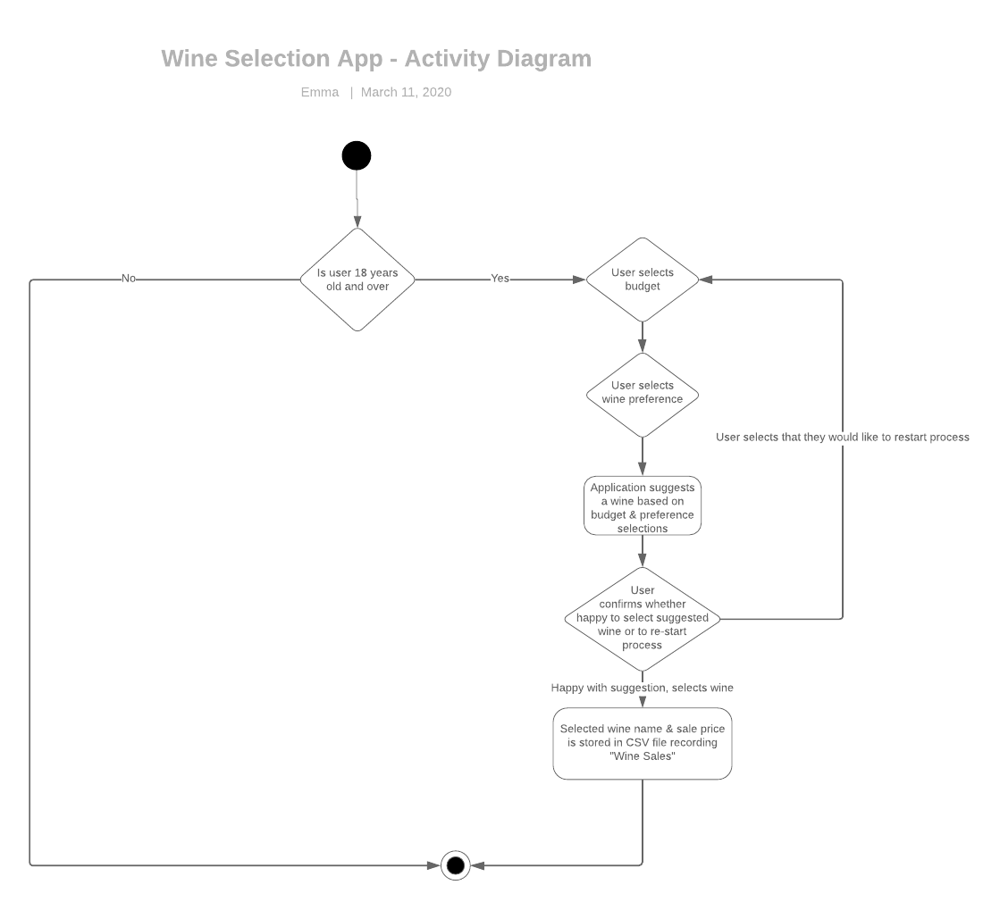

### Link to Source Code Repository:

#### https://github.com/emmabindi/wine-terminal-app.git

--- 

# Software Development Plan

## *Purpose*

"Em's Wine Selection Assistant" is a terminal app design to assist user's with the decision making process of identifying and selecting a bottle of wine to purchase from the list of available options, within their budget and according to their preference.

This app is designed to increase efficiency in decision making by filtering the available wine bottles to a suitable selection for the user. The app is also designed to ensure only users of a legal drinking age can participate.

The target audience for this app is wine lovers who are of a legal drinking age in Australia. 

A member of the target audience will use it by installing the required gems and running the ruby file. 
The user will then interact with the application by inputting their selections upon command into the terminal and following prompts.    
    
 --- 

## *Features*

**1. Age Filter**  

The application will utilise logic to provide control flow based on the condition of the user being under or of a legal drinking age in Australia. This feature should allow a retry attempt if user inputs data other than an integer.

**2. Budget Filter**  

The application will provide a selection of budget ranges for the user to choose from. This filter will then only suggest wine bottles to purchase if they fall within the user's budget. If user input does not match the budget options presented, an notification will present to let the user know they need to start the selection process from the beginning. And/or TTY-prompt gem will be utilised to ensure user can only select from the available options and no input errors occur.

**3. Wine Preference**  

The application will take input from the user on which wine category they would like to select from. The application will present a list of categories available to choose from: Sparkling, White, Rose, Orange, Red and Surprise and following on from the user's choice of one of these categories will then present wine bottles available which fall into this category only.   
If user input does not match the categories  presented, an notification will present to let the user know they need to start the selection process from the beginning. And/or TTY-prompt gem will be utilised to ensure user can only select from the available options and no input errors occur.   

**4.  Wine Suggestion List**  

Following on from obtaining the user's inputs of age, budget and preference, the application will then provide a list for the user to view of the suitable wine offerings available with additional information such as producers name, the country of origin, region, grape variety and sale price. The suggestion list will be colored in blue so it stands out.

**5. Wine Selection**  

The application will then accept a decision from the user to choose a particular bottle from the suggested list. It will also allow the user to reject the offered wines and re-start the selection process if user changes their mind or are unhappy with the suggestion. 

**6. Wine Sales Log**  

The application will have an in built function to output the user selections to a csv file which will record the wines selected and sales price. This output will continuously add the user selections and create a log of sales.  

--- 

### User Interaction and Experience 

The user will interact with this application by running the ruby program from their terminal. From the initialisation of the app, the terminal window will display prompts and menu options to the user. 

These prompts and messages will direct and guide the user through the application so that the features are accessed/utilised. 

Using the TTY-prompt gem will reduce the likelihood of user input created errors by limiting and controlling user inputs to selections from a pre-defined menu only. 

---   

### Control Flow Diagram

--- 

### Implementation Plan 

For this application I utilised Trello project management software. 
The link to access my Trello board "FastTrack Terminal" is below:

https://trello.com/invite/b/rYZ1aRYW/8158415533b26771d5aca5b295ca5421/fasttrack-terminal 

*The general / overarching priority ranking that I followed was:*

High Priority: 
 - create or locate data set of wine data for selection
 - create class for Wine 
 - create objects for wines in my data set ("wine list")
 - create display with welcome message
 - create function to obtain users age. Control flow based on age parameters 
 - testing and implement error handling for age function 

Medium Priority/or Dependant Tasks:
- create function to display budget options and obtain user selection
- testing and implement error handling for budget selection 
- ensure budget selection creates a new array with the wines within the budget parameters only
- create function to display wine type options and obtain user selection
- testing and implement error handling for wine type selection 
- display the suggested wine to the user based on budget and type 
- make the above display user friendly and conversational 
- present option to user to accept the suggested wine or reject it and restart the process 
- test the accept/reject wine suggestion function  
- create csv file to record sales log with wine name and price
- read csv file and push selected wine to the file
- test wine sales csv document push and ensure selections are appended to existing data not overwriting so a sales log/history is developed providing $ totals 

Low Priority / Final Tasks
- add artwork, font and colours to the menu options and text displays to make the interaction with teriminal more fun 
- perform testing of all functions and implement handling techniques 

--- 

## HELP Documentation 

### Installation Instructions

### Dependencies 

### System/Hardware Requirements

### How to use the application
